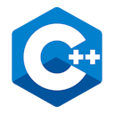

<!--

-->
<!--
<table style="margin: 0px auto;">
  <h2 style="text-align:center; text-decoration: none; border-bottom: none;">Languages</h2>
  
  <thead>
    <tr>
      <th style="text-align: center;">Level</th>
      <th style="text-align: center;">Language</th>
    </tr>
  </thead>
  <tbody>
    <tr>
      <td>Intermediate</td>
      <td>
        <table>
          <tr>
            <td valign="center">
              
            </td>
          </tr>
        </table>
      </td>
    </tr>
    <tr>
      <td>Below Intermediate</td>
      <td>
        <table>
          <tr>
            <td valign="center">
              
            </td>
            <td valign="center">
              
            </td>
            <td valign="center">
              
            </td>
            <td valign="center">
              
            </td>
          </tr>
        </table>
      </td>
    </tr>
    <tr>
      <td>Beginner</td>
      <td>
        <table>
          <tr>
            <td valign="center">
              
            </td>
            <td valign="center">
              
            </td>
            <td valign="center">
              
            </td>
            <td valign="center">
              
            </td>
            <td valign="center">
              
            </td>
          </tr>
        </table>
      </td>
    </tr>
    <tr>
      <td>Learning</td>
      <td>
        <table>
          <tr>
            <td valign="center">
              
            </td>
          </tr>
        </table>
      </td>
    </tr>
    <tr>
      <td>Want To Learn</td>
      <td>
        <table>
          <tr>
          </tr>
        </table>
      </td>
    </tr>
  </tbody>
</table>
-->
<h2 style="text-align:center; text-decoration: none; border-bottom: none;">IDE's I Use</h2>

<table>
  <tr>
    <td valign="center">
      
    </td>
    <td valign="center">
      
    </td>
  </tr>
</table>

<!-- <h2 style="text-align:center; text-decoration: none; border-bottom: none;">Currently Working On</h2> -->

<!--  -->

<h2 style="text-align:center; text-decoration: none; border-bottom: none;">Stats</h2>

<!--

-->

<h2 style="text-align:center; text-decoration: none; border-bottom: none;">Favourite Repo</h2>

<!--

-->

<!-- <h2 style="text-align:center; text-decoration: none; border-bottom: none;">Other Stats</h2> -->

<h2 style="text-align:center; text-decoration: none; border-bottom: none;">My Discord Profile</h3>

<!-- <h3 style="text-align:center; text-decoration: none; border-bottom: none;">WakaTime</h3> -->

<!-- <h3 style="text-align:center; text-decoration: none; border-bottom: none;">Profile Views</h3> -->

